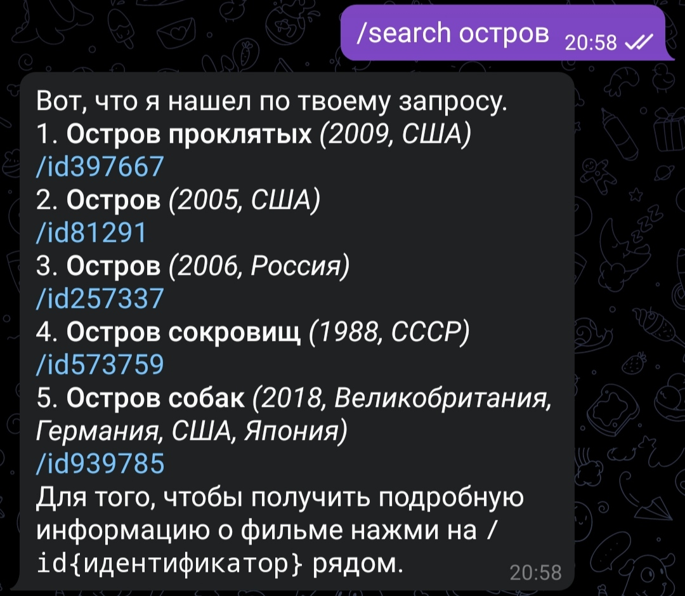

### kino-tg-bot

Небольшой бот для поиска фильмов, написанный с использованием aiogram / aiohttp и (не)официального API сервиса [Кинопоиск](https://www.kinopoisk.ru/).

#### Команды
* `/help` -- информация о боте и возможных командах.
* `/search название_фильма` -- поиск фильмов по ключевым словам, возвращает список фильмов, о каждом из которых можно узнать с помощью `/id{идентификатор}`.
* `/id{идентификатор}` -- подробная информация о фильме.
* `/sim{идентификатор}` -- список похожих фильмов.

#### Примеры работы

<a>Картинки бота</a>

 

<a>Картинки веб-приложения</a>

 